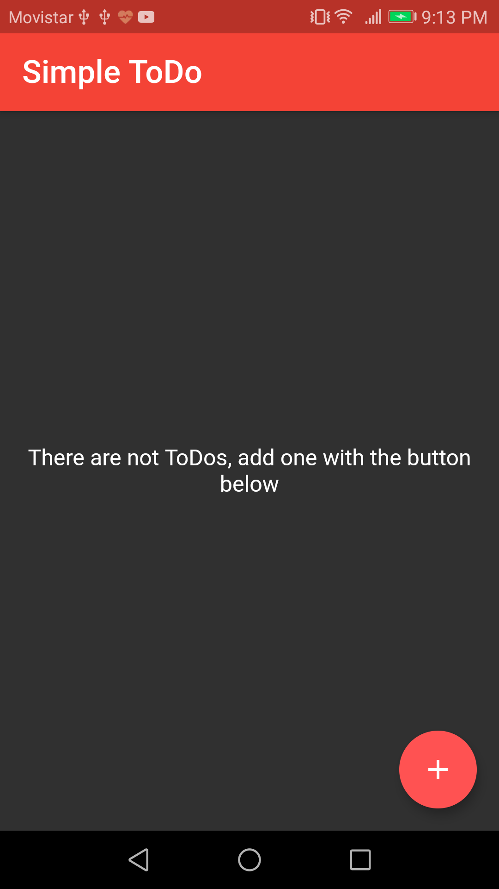
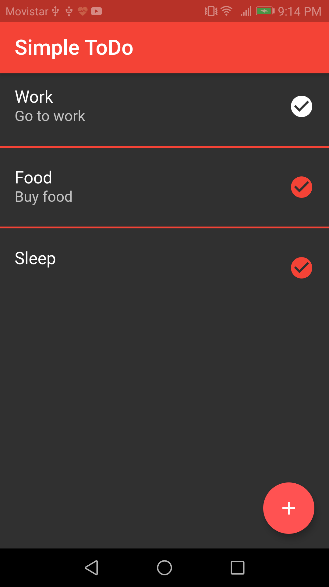
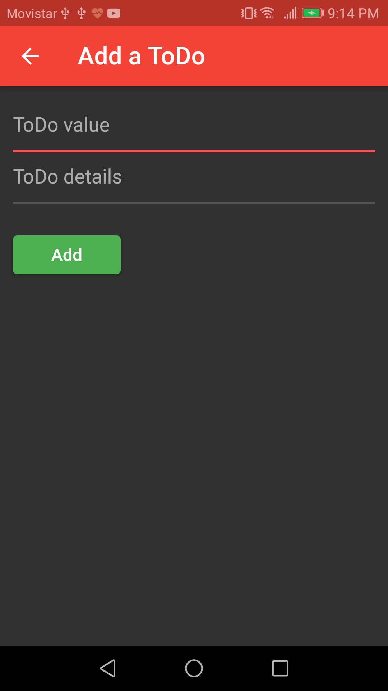
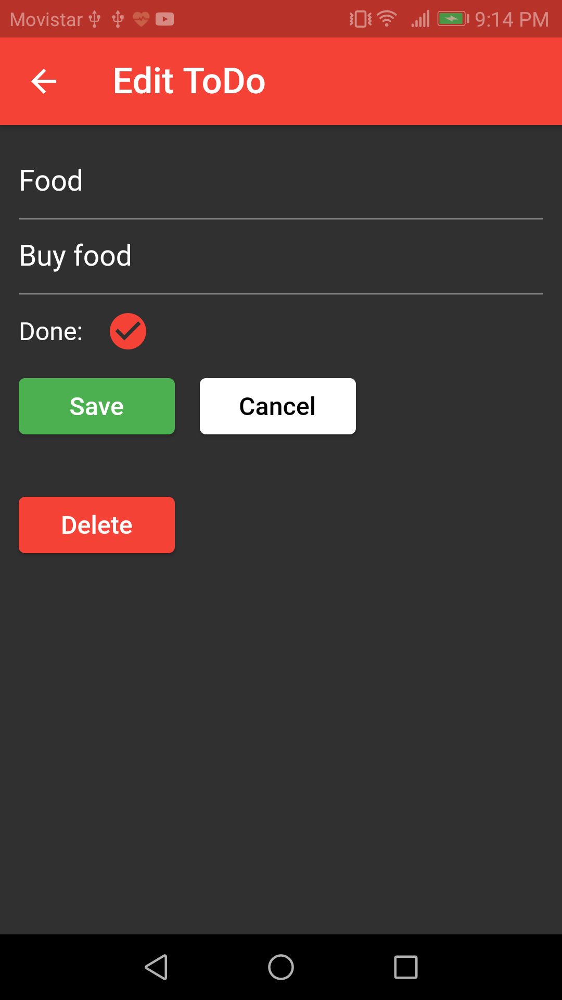

# Simple-ToDo-Flutter

A simple ToDo app in Flutter for IOS and Android with a little navigation and a local database / Una simple app de ToDo en Flutter para IOS y Android con navegación y una base de datos local.

## See the app in action / Mire la aplicación en funcionamiento

## Some features / Algunas características

- Local database CRUD with SQFLite package (SQLite)
- State management with Cubit (flutter_bloc package)
- Navigation and changes of state from multiples screens
- A simple dependency injection with getIt package
- Load assets files

## Some images / Algunas imágenes

| 

 | 

 |
| ---------------------------------------------------------------------------- | ------------------------------------------------------------------------------ |
| 

 | 

  |
